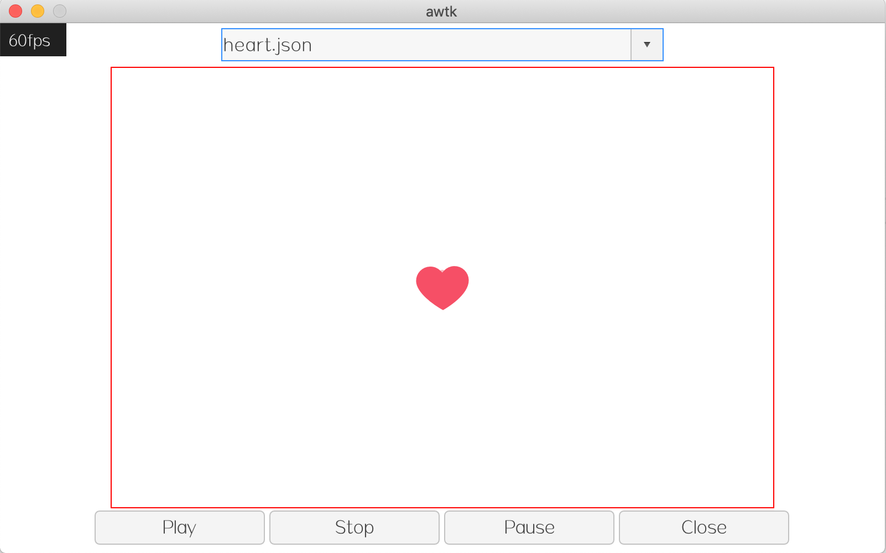

# awtk-widget-rlottie

[Lottie](https://airbnb.design/lottie)  是一个超级强大的动画库，众多工具可以创建并导出 [Lottie](https://airbnb.design/lottie) 格式的动画。 [Lottie](https://airbnb.design/lottie) 用 JSON 描述动画，与比 gif 等图片动画相比，体积大大减小。如果性能跟得上，是做动画的不错选择。借助三星开源的 [rlottie](https://github.com/Samsung/rlottie) 库，AWTK 可以直接播放 [Lottie](https://airbnb.design/lottie)  动画。

[rlottie player](https://github.com/zlgopen/awtk-widget-rlottie) 控件是基于 [rlottie](https://github.com/Samsung/rlottie) 实现的 [Lottie](https://airbnb.design/lottie/) 播放器。



## 准备

1. 获取 awtk 并编译

```
git clone https://github.com/zlgopen/awtk.git
cd awtk; scons; cd -
```

更新最新的 rlottie（由维护者完成）。

```
git clone https://github.com/Samsung/rlottie src/rlottie_impl
```

## 运行
1. 生成示例代码的资源

```
python scripts/update_res.py all
```
> 也可以使用 Designer 打开项目，之后点击 “打包” 按钮进行生成；
> 如果资源发生修改，则需要重新生成资源。

如果 PIL 没有安装，执行上述脚本可能会出现如下错误：
```cmd
Traceback (most recent call last):
...
ModuleNotFoundError: No module named 'PIL'
```
请用 pip 安装：
```cmd
pip install Pillow
```

2. 编译

* 编译 PC 版本

```
scons
```

* 编译 LINUX FB 版本

```
scons LINUX_FB=true
```

> 完整编译选项请参考 [编译选项](https://github.com/zlgopen/awtk-widget-generator/blob/master/docs/build_options.md)

3. 运行

```
./bin/demo
```

## 文档

* 在 XML 创建的方法

```xml
  <rlottie x="c" y="m" w="600" h="400" name="rlottie" url="heart.json"/>
```

* [完善自定义控件](https://github.com/zlgopen/awtk-widget-generator/blob/master/docs/improve_generated_widget.md)
